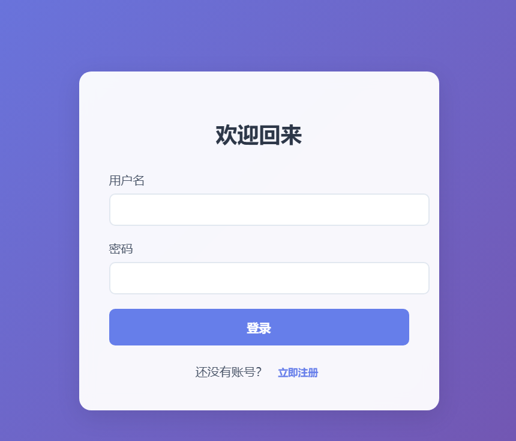
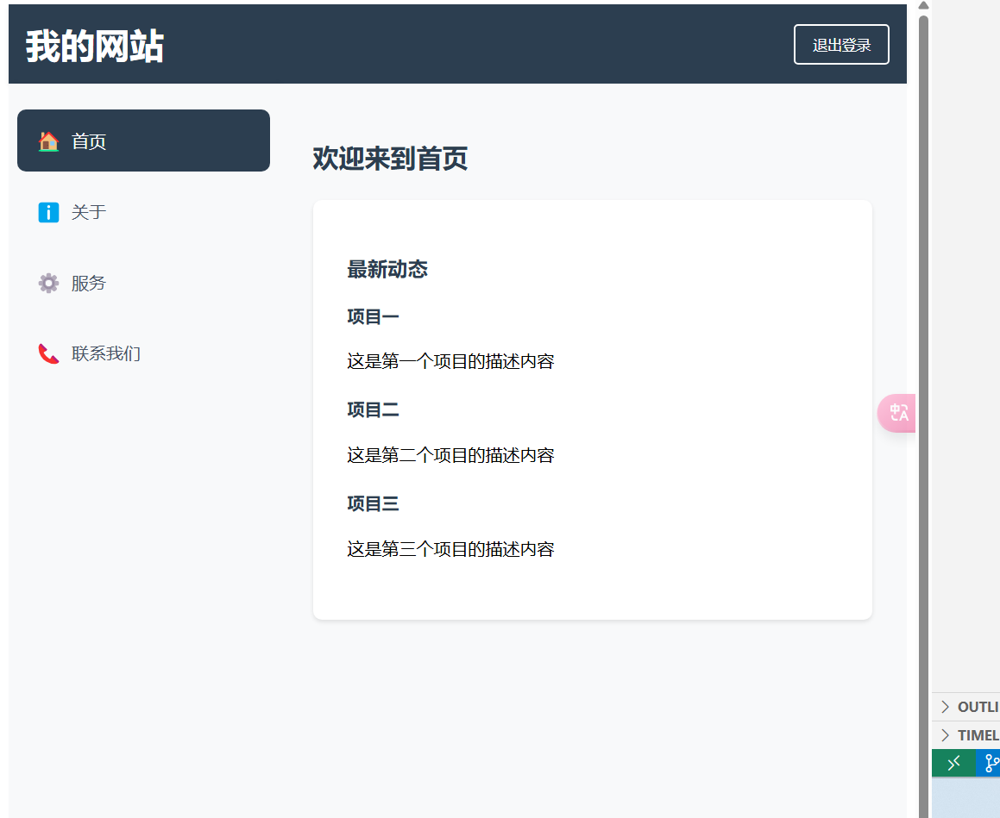

# React 企业网站模板

这是一个使用 React 开发的现代化企业网站模板，具有清晰的布局和用户友好的界面设计。

## 项目截图

### 登录界面


### 主界面


## 功能特点

- 🔐 用户认证系统
  - 登录功能
  - 注册功能
  - 路由保护

- 📱 响应式设计
  - 适配各种屏幕尺寸
  - 移动端友好的导航栏
  - 流畅的动画效果

- 🎨 现代化界面
  - 清晰的布局结构
  - 优雅的配色方案
  - 平滑的过渡动画

- 📋 主要页面
  - 首页：展示公司最新动态
  - 关于：介绍公司信息
  - 服务：展示公司提供的服务
  - 联系：包含联系方式和留言表单

## 技术栈

- React 18
- React Router v6
- 原生CSS-in-JS样式方案
- LocalStorage 用户状态管理

## 安装说明

1. 克隆项目
```bash
git clone [项目地址]
cd react-basic
```

2. 安装依赖
```bash
npm install
```

3. 启动开发服务器
```bash
npm start
```

4. 构建生产版本
```bash
npm run build
```

## 项目结构

```
src/
  ├── components/        # 通用组件
  │   ├── Header.js     # 页头组件
  │   ├── Sidebar.js    # 侧边栏导航
  │   └── Login.js      # 登录组件
  │
  ├── pages/            # 页面组件
  │   ├── Home.js       # 首页
  │   ├── About.js      # 关于页面
  │   ├── Services.js   # 服务页面
  │   └── Contact.js    # 联系页面
  │
  └── App.js            # 应用入口和路由配置
```

## 使用说明

1. 访问登录页面 `/login`
2. 使用以下任意账号登录：
   - 用户名：任意
   - 密码：任意
3. 登录后可以访问所有功能页面
4. 点击右上角的"退出登录"按钮可以退出当前账号

## 自定义配置

1. 修改主题颜色
   - 在各组件中更新 style 对象中的颜色值
   - 主要使用的颜色：
     - 主色：`#2c3e50`
     - 背景色：`#f8f9fa`
     - 文字颜色：`#4a5568`

2. 添加新页面
   - 在 `src/pages` 目录下创建新的页面组件
   - 在 `App.js` 中添加新的路由配置
   - 在 `Sidebar.js` 中添加新的导航项

## 开发建议

1. 组件开发
   - 保持组件的单一职责
   - 使用函数式组件和 Hooks
   - 注意组件的可重用性

2. 样式管理
   - 使用 CSS-in-JS 保持样式的模块化
   - 保持样式的一致性
   - 注意响应式设计

3. 状态管理
   - 合理使用 React Hooks
   - 适当使用 LocalStorage
   - 注意状态更新的性能

## 贡献指南

欢迎提交 Issue 和 Pull Request 来帮助改进这个项目。

## 许可证

MIT License